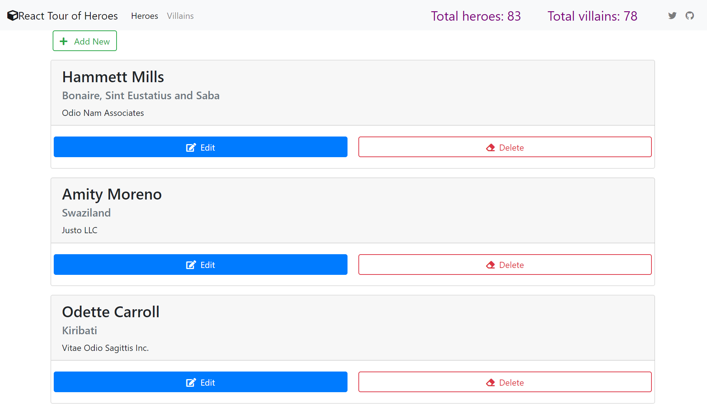

# My version of Tour of Heroes app using ReactJS Hooks with Easy Peasy State Management.

### Features

Hooks, Easy Peasy (redux with thunk wrapper), HTTP request (using axios), navigation params, 2 stores, computed values.

### To run the project after cloning

Create or go to your demo directory then run the following in the terminal or cmd.

```sh
$ git clone https://github.com/webmasterdevlin/heroes-easy-peasy.git
$ cd features-easy-peasy
$ npm install
$ npm run start
```

The React app and the fake web service will run concurrently.


